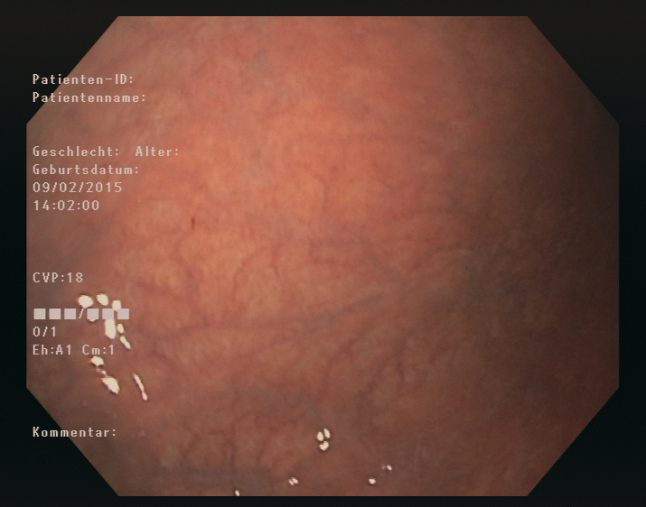

# Group Meeting Outline

## ​1. Gannt Chart

Teams file

## 2. VPN

## 3. Obvious differences between ab- and normal imgs - atrophic gastritis gastroscopy image features 

### ①The submucosal blood vessels are visible; 

### ②The mucosal folds are fine or even disappear; 

### ③The color of the gastric mucosa becomes light; 

### ④Atrophic gastritis may be accompanied by chronic superficial gastritis. Manifestations, such as hyperemia, attached mucus, and increased reflection;

### ⑤Atrophic mucosa is more fragile, easy to bleed, and may have erosions; 

### ⑥When atrophic gastritis is accompanied by excessive glandular neck hyperplasia or intestinal epithelial metaplasia, the mucosal surface is rough and uneven, granular or granular. Nodules, sometimes the formation of pseudopolyps can be seen, and the features of submucosal blood vessels are often hidden; 

①黏膜下血管透见；②黏膜皱襞细小甚至消失；③胃黏膜颜色变淡；④萎缩性胃炎可同时伴有慢性浅表性胃炎的表现，如充血红斑、附着黏液，以及反光增强等；⑤萎缩黏膜脆性增加，易出血，并可有糜烂灶；⑥当萎缩性胃炎伴有腺体颈部过度增生或肠上皮化生时，黏膜表面粗糙不平，呈颗粒状或结节状，有时可见假息肉形成，而黏膜下血管显露的特征常被掩盖。

## 4. DICOM img

## 5. Data augmentation

### a\) original color img

### b\) grayscale img

seperate / together training

### c\) scaling, mirroring, rotation \(library!!!\)

## 6. Data visualization ?

## 7. Original paper OUTLINE

### Research target

overcome the limitations of white-light endoscopy in diagnosing atrophic gastritis;

### Approach

* a DL approach
* two datasets: 

## 8. 3 more other papers

### a\) Diagnosing chronic atrophic gastritis by gastroscopy using artificial intelligence

5470 imgs in tutoal, 1699 patients, 3042 positive, 2428 negative

accuracy 0.942

Transfer Learning - DenseNet

link: [https://www.dldjournalonline.com/article/S1590-8658\(20\)30003-7/fulltext](https://www.dldjournalonline.com/article/S1590-8658%2820%2930003-7/fulltext)

### b\) Expert-level classification of gastritis by endoscopy using deeplearning: a multicenter diagnostic trial

8141 imgs in total, 4587 patients

accuracy 0.888

Transfer Learning - Unet++ for segmentation and Resnet-50 for classification

link: chrome-extension://oemmndcbldboiebfnladdacbdfmadadm/[https://www.researchgate.net/publication/351927296\_Expert-level\_classification\_of\_gastritis\_by\_endoscopy\_using\_deep\_learning\_a\_multicenter\_diagnostic\_trial/fulltext/60b0a01aa6fdcc647ee365d9/Expert-level-classification-of-gastritis-by-endoscopy-using-deep-learning-a-multicenter-diagnostic-trial.pdf?\_sg%5B0%5D=Bhk912xnmVUnjR9g4iyMf\_K\_nmJwfyNqpAbqhG1Xkl7OkllO3ltVnvwYGSSW3eyxirfDpUkDcBfXjARleVF8pg.GQXPr0QbQCyKHFoacAblMC0om4Z3Iini44KsaF4d2vSaR7YSI0osiZvhjshzRiZ0jcVCj67o4gPkHoCNiRRHLQ&\_sg%5B1%5D=p5SNGiS\_xPZ8tOQ-E-x\_q0ShTXE1N4\_KIk-jkYQsrPadFP1kc9kL6p7Fk87AneXNeILFVwFOpUdKAyTZ5T5sU7eRGwlW9JMeZz4\_nes5OqZc.GQXPr0QbQCyKHFoacAblMC0om4Z3Iini44KsaF4d2vSaR7YSI0osiZvhjshzRiZ0jcVCj67o4gPkHoCNiRRHLQ&\_sg%5B2%5D=n-8jJqA0VE23C4\_W7pV96bz-VRaXFvsJ6iOR\_ZbIOSQgB\_y\_R4yuSD8x73EauIjCJT0JPFBiD-imb7c.alE7eO7eQfNWSuo2ozuj7I76w4uYK-EldBNIqvQMDmf-bKeZDIUbwRGrv3pM6L\_a5iW3\_fv3eqrtI5-HIdF9Ng&\_iepl=](https://www.researchgate.net/publication/351927296_Expert-level_classification_of_gastritis_by_endoscopy_using_deep_learning_a_multicenter_diagnostic_trial/fulltext/60b0a01aa6fdcc647ee365d9/Expert-level-classification-of-gastritis-by-endoscopy-using-deep-learning-a-multicenter-diagnostic-trial.pdf?_sg%5B0%5D=Bhk912xnmVUnjR9g4iyMf_K_nmJwfyNqpAbqhG1Xkl7OkllO3ltVnvwYGSSW3eyxirfDpUkDcBfXjARleVF8pg.GQXPr0QbQCyKHFoacAblMC0om4Z3Iini44KsaF4d2vSaR7YSI0osiZvhjshzRiZ0jcVCj67o4gPkHoCNiRRHLQ&_sg%5B1%5D=p5SNGiS_xPZ8tOQ-E-x_q0ShTXE1N4_KIk-jkYQsrPadFP1kc9kL6p7Fk87AneXNeILFVwFOpUdKAyTZ5T5sU7eRGwlW9JMeZz4_nes5OqZc.GQXPr0QbQCyKHFoacAblMC0om4Z3Iini44KsaF4d2vSaR7YSI0osiZvhjshzRiZ0jcVCj67o4gPkHoCNiRRHLQ&_sg%5B2%5D=n-8jJqA0VE23C4_W7pV96bz-VRaXFvsJ6iOR_ZbIOSQgB_y_R4yuSD8x73EauIjCJT0JPFBiD-imb7c.alE7eO7eQfNWSuo2ozuj7I76w4uYK-EldBNIqvQMDmf-bKeZDIUbwRGrv3pM6L_a5iW3_fv3eqrtI5-HIdF9Ng&_iepl=)

### c\) Application of artificial intelligence using a convolutional neural network for detecting gastric cancer in endoscopic images

SSD \(Single Shot Multibox Detector\) - 16 layers - Caffee deep learning framework

## Reinforcement Learning

## Transfer Learning

## 9. set Regular email alarm

## 10. To decide in the meeting

### 1\) Solutions

only one, but should have an alternative model

training data schemes \(original, greyscale, original + greyscale\)

### 2\) Presentation slides

#### who takes care of which part - Due on next Monday

